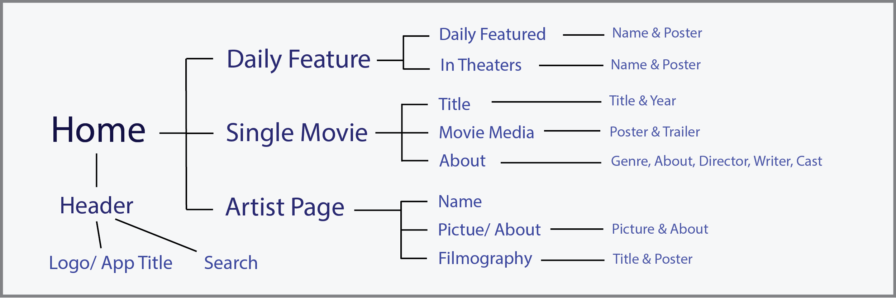
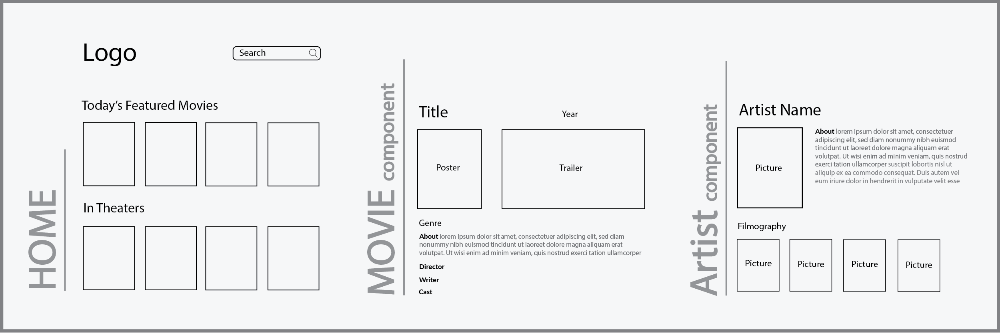

# A Movie Database React App

This project uses React and the [https://www.themoviedb.org/] API to help users find trivia on movies.

## `Beginning Stage`

After creating my initial react app I mapped out my parent and child components. 

### Component Mapping

I then planned my schema/layouts with Adobe Illustrator.

### App Schema

### `...`
