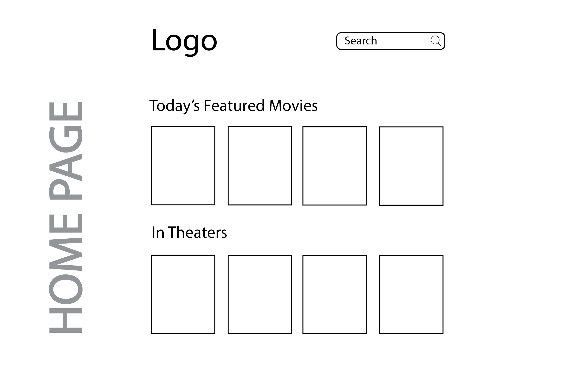
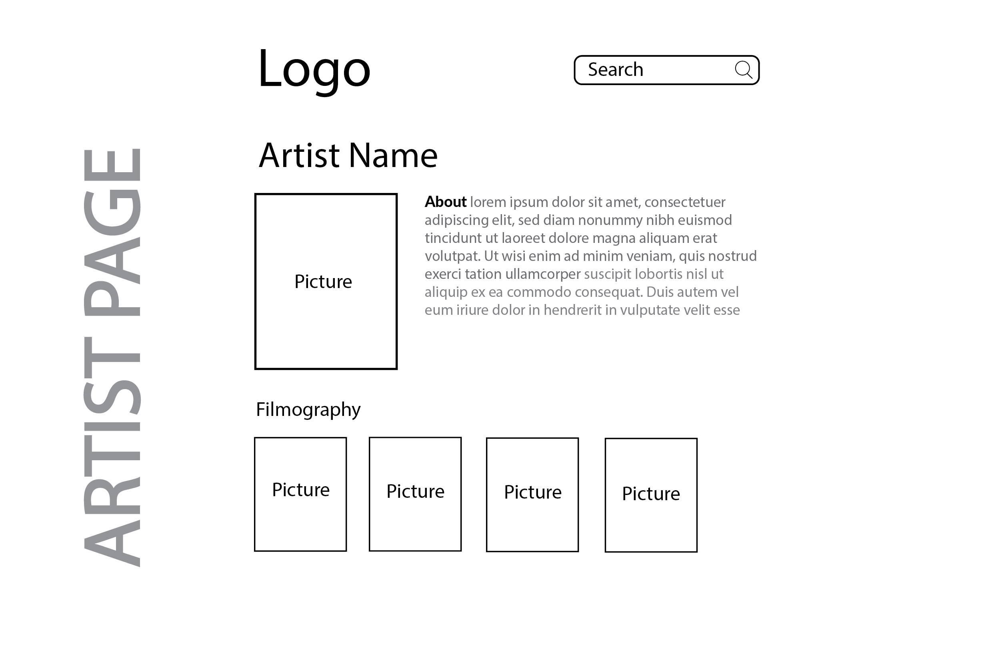

# A Movie Database React App

This project uses React and the [https://www.themoviedb.org/] API to help users find trivia on movies.

## `Beginning Stage`

After creating my initial react app I planned my layouts with Adobe Illustrator.

### `...`
